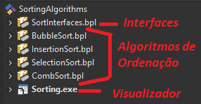
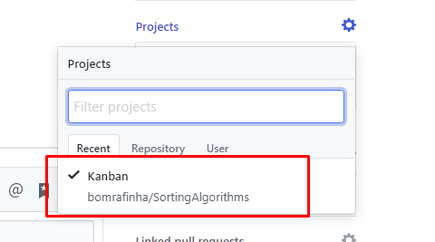

# Algoritmos de Ordenação (Delphi)

>Mostra visualmente os diversos algoritmos de ordenação, desenvolvido em Delphi.

<br />


 


<br />

*******
## Índice
 1. [Uso](#uso)
 2. [Sitemap](#sitemap)
 3. [Estrutura](#estrutura)
 4. [Workgroup](#workgroup)
 5. [Dependências](#dependencias)
 6. [Contribuir](#contribuir)
 7. [Checklist para Contribuir](#checklist)
 8. [Créditos](#creditos)
 9. [Licença](#licenca)
 10. [Padronização de Código](#source)
 11. [TODO](#todo)
 12. [Árvore do Projeto](#arvore)
*******

<br />

## Uso <a name="uso"></a>

<br />
 
## [Sitemap](https://coggle.it/diagram/XoYMQknCLnN4AiG_/t/sortingalgorithms/b5af2e2a2462c3902697b70700706b3bb400f72cea88fc201b92409f637f7d35) <a name="sitemap"></a>   


<br />

## Estrutura <a name="estrutura"></a>
+ **app:** Contém a compilação do(s) pacote(s) e tela de demonstração;
+ **documentation:** Contém a documentação do(s) pacote(s);
+ **images:** Contém as imagens usadas no(s) pacote(s);
+ **modules:** Contém os algoritmos de ordenação, cada módulo (pacote) corresponde à um algoritmo específico;
+ **output:** Contém os arquivos pré compilados usados pelo Delphi (.dcu);
+ **project:** Diretório com os projetos de cada pacote e visualizador;
+ **src:** Contém o fonte do visualizador e fontes comuns a todos;
+ **vendor:** Contém os pacotes de terceiros;
 
<br />

## Workgroup <a name="workgroup"></a>
Deve-se manter a ordem de compilação do projeto como na imagem. Interfaces sempre no primeiro pacote *SortInterfaces.bpl*, e a visualização no executável *Sorting.exe* que será sempre o último pacote.



<br />

## Dependências <a name="dependencias"></a>
+ **Sem dependências até o momento.**

<br />

## Contribuir <a name="contribuir"></a>
1. Faça um "fork" com base no master;
2. Faça "commit" de suas alterações (Caso estiver resolvendo alguma "issue" não esqueça de na mensagem escrever "Fixed #numeroIssue");
3. Faça "push" de seus commits;
4. Solicite um "pull request" para o master do repositório principal.

### Criando uma *Issue*
Para criar uma *issue* atente para o seguinte:
+ Selecionar o *label* adequado para a *issue* (esse *label* poderá vir a ser alterado, mas a não designação faz com que a *issue* fique perdida).


+ Selecionar o projeto *Kanban*, isso organizará o que está sendo feito e o que deverá ser feito.



<br />

## Checklist para Contribuir <a name="checklist"></a>
+ Testar as funcionalidades criadas / alteradas;
+ Marcar com "#" os issues concluídos, nos commits;
+ Readme (caso nescessário)
  - Número do build;
  - Alterar indice;
  - Alterar / adicionar forma de uso;
  - Incluir pacotes / classes / métodos / parâmetros nas formas de uso;
  - Alterar sitemap;
  - Alterar estrutura da aplicação;
  - Imagem atualizada do Workgroup;
  - Adicionar / Remover dependências (pacotes de terceiros);
  - Atualizar a documentação do fonte;
  - Remover / adicionar itens ao TODO;
  - Atualizar árvore do projeto;
+ Ao adicionar itens ao TODO, não esquecer de criar a "issue" correspondente;
  * Labels principais
    - **bug:** Correção de algum problema;
    - **documentation:** Alteração na documentação;
    - **enhacement:** Alteração de funcionalidade existente para melhorá-la;
    - **feature:** Nova funcionalidade;
  * Projeto
    - **Kanban:** Para melhor organizar o projeto;

<br />

## Créditos <a name="creditos"></a>
[@bomrafinha](https://github.com/bomrafinha)

<br />

## [Licença](./LICENSE) <a name="licenca"></a>

<br />

## Padronização de Código <a name="source"></a>
### Versionamento
Para versionar esse repositório deve-se usar como base o versionamento para windows 32 bits do Sorting.exe, da forma que se segue:


#### onde:
1. Versão principal, só muda quando o funcionamento básico do sistema altera de forma considerável;
2. Quantidade de módulos funcionais do sistema (cada algoritmo de ordenação representa um módulo);
3. Quantidade de funções públicas disponíveis no sistema;
4. Versão de build do sistema auto-gerado pelo Delphi;
5. Deve-se manter o build como auto incremento;

Para cada teste compilado com sucesso deve-se dar *build* no .exe para versionar (shift + F9).

Os *releases* do repositório serão feitos a cada vez que um módulo estiver 100% finalizado (considerando que um módulo equivale à um algoritmo de ordenação), ou quando um conserto muito relevante for realizado.

<br />

### Padrões adotados no projeto
Para um melhor entendimento do projeto foi-se adotado alguns padrões que facilitam a identificação de cada estrutura usada. São, basicamente, o uso de *camelCase*, e *PascalCase*;

#### Variáveis de método
Variáveis locais devem ser *camelCase*.

Observar o espaçamento entre a declaração de variáveis e o inicio do método.


#### Variáveis privadas
A declaração de váriaveis privadas deve ocorrer sempre dentro dos modificadores de acesso. 

Devem ser *camelCase* começando sempre com "f" seguido por seu nome.


#### Propriedades
Propriedades devem usar *PascalCase*.

Devem ter exatamente o nome de sua variável privada e/ou metodo de acesso, eliminando apenas o prefixo (f, get, set).


#### Métodos
A declaração de métodos deve ocorrer sempre dentro dos modificadores de acesso. 

Métodos devem ser *camelCase*.

Os parâmetros do método devem ser *camelCase* iniciando com "a".

Procurar, quando possível, usar prefixos *get*, *set*, *eh*, etc de acordo com a função do método e/ou seu retorno.

Ao serem chamados usar sempre parentesis em sua chamada, mesmo quando sem parâmetros. Ex: meuMetodo();


#### Interfaces
Interfaces devem começar sempre com a letra "I" (maiúsculo), seguido por seu nome em *PascalCase*.


#### Classes
Classes devem começar sempre com a letra "T" (maiúsculo), seguido por seu nome em *PascalCase*.

Classes que não extendem nenhuma outra classes em específico devem extender *TInterfacedObject*.


#### Chamada de métodos em múltiplas linhas
Métodos com chamadas muito extensas devem ser chamados usando padrão de identação JSON.


#### Uso de blocos *begin end*
Estruturas que não se utilizam do bloco de abertura e fechamento de código, como *ifs* de uma linha, em um código muito extenso geralmente atrapalham na leitura do código para posteriores modificações. Por esse motivo **todas** as estruturas devem possuir o bloco de abertura e fechamento (*begin .. end*)


#### Identação
Modificadores de acesso devem ser declarados de forma a ficarem alinhados à declaração da classe.

Declaração de métodos, propriedades, construtores/destrutores, bem como o *var* da declaração de variáveis, devem estar alinhados.

Agrupar *procedures* e *functions* sem alterná-los.

Separar declações de variáveis, métodos, construtores, destrutores e propriedades com uma linha em branco, bem como deixar uma linha em branco antes da declaração de modificador de acesso, ou fim do bloco, exceto no primeiro modificador após a declaração da classes.


#### Chamada de métodos e variaveis internas da classe

Devem ser precedidas da palavra reservada *Self*, para facilitar a leitura do código.


#### Palavras Reservadas
Dá-se preferência ao uso de iniciais minúsculas para palavras reservadas. Porém isso não é uma regra para o projeto tendo em vista que por serem reservadas a IDE às sinaliza, não atrapalhando, assim, a leitura do código.

#### Um código bem padronizado é muito mais fácil de ler, mesmo por programadores que utilizam outras linguagens.

<br />

## TODO <a name="todo"></a>
+ Documentação
  - Forma de Uso
  - Colocar algoritmos no TODO

+ Estrutura básica do código

+ Algoritmos
  - Bogo Sort
  - Merge Sort
  - Heap Sort
  - Shell Sort
  - Radix Sort
  - Gnome Sort
  - Counting Sort
  - Bucket Sort
  - Cocktail Sort
  - Tim Sort
  - Quick Sort

<br />

## Árvore do Projeto <a name="arvore"></a>
```
SortingAlgorithms
├── app
│   └── .gitkeep
├── documentation
│   └── images
│       ├── label_issue.png
│       ├── padrao_blocos_01.png
│       ├── padrao_blocos_02.png
│       ├── padrao_chamadas_01.png
│       ├── padrao_chamadas_02.png
│       ├── padrao_classes.png
│       ├── padrao_identacao_01.png
│       ├── padrao_interfaces.png
│       ├── padrao_metodos.png
│       ├── padrao_propriedades.png
│       ├── padrao_self_01.png
│       ├── padrao_variaveis_locais.png
│       ├── padrao_variaveis_privadas.png
│       ├── project_issue.png
│       ├── sitemap.png
│       ├── versionamento.png
│       └── workgroup.png
├── images
│   └── .gitkeep
├── modules
│   ├── BubbleSort
│   │   └── U_Sort.Bubble.pas
│   ├── CombSort
│   │   └── U_Sort.Comb.pas
│   ├── InsertionSort
│   │   └── U_Sort.Insertion.pas
│   └── SelectionSort
│       └── U_Sort.Selection.pas
├── output
│   └── .gitkeep
├── project
│   ├── BubbleSort.dpk
│   ├── BubbleSort.dproj
│   ├── CombSort.dpk
│   ├── CombSort.dproj
│   ├── InsertionSort.dpk
│   ├── InsertionSort.dproj
│   ├── SelectionSort.dpk
│   ├── SelectionSort.dproj
│   ├── Sorting.dpr
│   ├── Sorting.dproj
│   ├── SortingAlgorithms.groupproj
│   ├── SortInterfaces.dpk
│   └── SortInterfaces.dproj
├── src
│   ├── Sorting
│   │   ├── U_Sorting.Viewer.fmx
│   │   └── U_Sorting.Viewer.pas
│   └── SortInterfaces
│       ├── U_Sort.DTO.Retangle.pas
│       ├── U_SortClass.pas
│       └── U_SortInterface.pas
├── vendor
│   └── .gitkeep
├── .gitattributes
├── .gitignore
├── LICENSE
└── README.md
```
